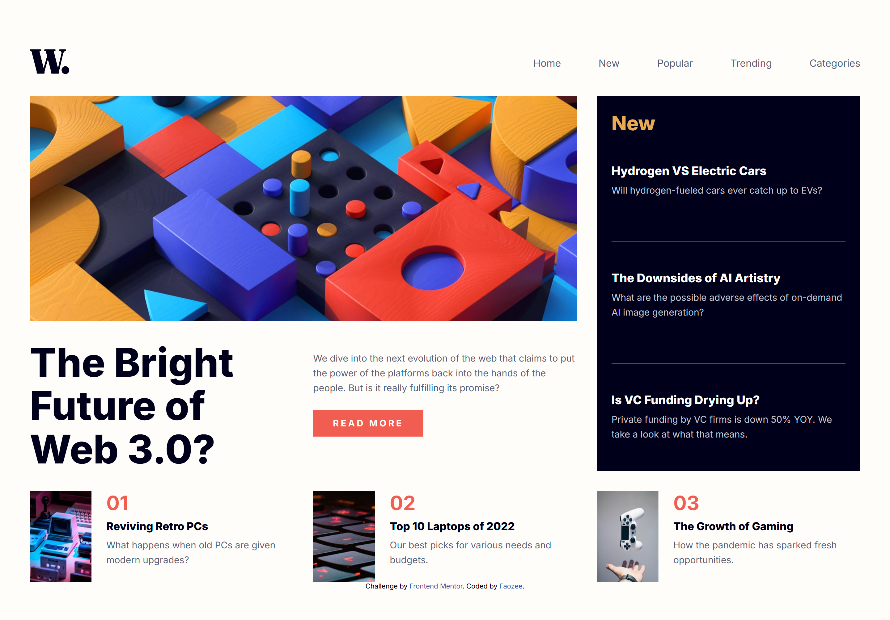
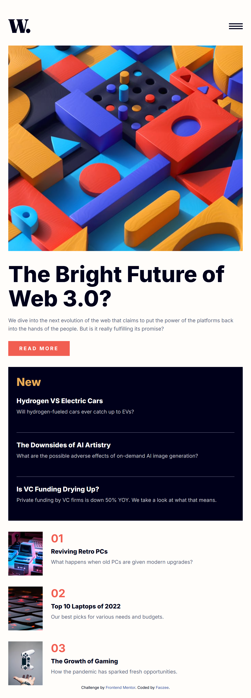

# Frontend Mentor – News Homepage (Solution)

This is my solution to the [News homepage challenge](https://www.frontendmentor.io/challenges/news-homepage-H6SWTa1MFl) on Frontend Mentor.

## Table of Contents
- [Overview](#overview)
  - [The challenge](#the-challenge)
  - [Screenshots](#screenshots)
  - [Links](#links)
- [Features](#features)
- [Implementation](#implementation)
  - [Tech stack](#tech-stack)
  - [Folder structure](#folder-structure)
  - [Key UI pieces](#key-ui-pieces)
- [Accessibility](#accessibility)
- [What I learned](#what-i-learned)
- [How to run locally](#how-to-run-locally)
- [Possible improvements](#possible-improvements)
- [Author](#author)
- [Acknowledgments](#acknowledgments)

## Overview

### The challenge
Users should be able to:
- View the optimal layout on mobile and desktop
- See hover and focus states for interactive elements
- Open and close a mobile navigation menu
- Read highlighted “New” articles and featured stories

### Screenshots

**Desktop**


**Mobile**


### Links
- **GitHub Repo:** https://github.com/busa0019/news-homepage-main
- **Live Site:** https://busa0019.github.io/news-homepage-main/
- **Challenge:** https://www.frontendmentor.io/challenges/news-homepage-H6SWTa1MFl

## Features
- Responsive header with logo and navigation
- Hamburger menu that opens a slide-in nav on small screens
- Overlay that closes the menu when tapped
- CSS Grid layout for the hero, “New” panel, and article list
- Mobile and desktop hero images (`image-web-3-mobile.jpg` and `image-web-3-desktop.jpg`)
- Button style for “Read more” call to action

## Implementation

### Tech stack
- Semantic HTML5
- CSS with custom properties and media queries
- Vanilla JavaScript for the mobile menu
- Separate `reset.css` using “The new CSS reset” pattern

### Folder structure
```
.
├── index.html
├── css/
│   ├── reset.css
│   └── main.css
├── assets/
│   └── images/
│       ├── favicon-32x32.png
│       ├── logo.svg
│       ├── icon-menu.svg
│       ├── icon-menu-close.svg
│       ├── image-web-3-desktop.jpg
│       ├── image-web-3-mobile.jpg
│       ├── image-retro-pcs.jpg
│       ├── image-top-laptops.jpg
│       └── image-gaming-growth.jpg
├── design/
│   ├── mydesktop-preview.png
│   └── mymobile-preview.png
└── script.js
```

### Key UI pieces
- **Header and Nav**
  - `.hamburger` toggles the mobile menu
  - `.close-menu` closes it
  - `.overlay` covers the page and closes the menu on click
- **Hero section**
  - Switches image source by breakpoint using `.mobile-img` and `.desktop-img`
- **“New” panel**
  - Dark panel with section divider lines
- **Article list**
  - Three compact items with thumbnail, index number, title, and summary

## Accessibility
- Meaningful `alt` text on images
- Clear click targets for opening and closing the menu
- Overlay click closes the menu to reduce trap situations
- Consider adding `aria-controls`, `aria-expanded`, and focus management as an enhancement

## What I learned
- Managing a mobile menu with a simple class toggle and overlay
- Structuring a landing page with CSS Grid for visual hierarchy
- Keeping resets and site styles in separate files for clarity and caching

### Menu logic used
```js
const menuIcon = document.querySelector('.hamburger');
const closeIcon = document.querySelector('.close-menu');
const navLinks  = document.querySelector('.nav-links');
const overlay   = document.querySelector('.overlay');

// Open menu
menuIcon.addEventListener('click', () => {
  navLinks.classList.add('active');
  overlay.classList.add('active');
  menuIcon.style.display = 'none';
  closeIcon.classList.add('active');
});

// Close menu
closeIcon.addEventListener('click', () => {
  navLinks.classList.remove('active');
  overlay.classList.remove('active');
  menuIcon.style.display = 'block';
  closeIcon.classList.remove('active');
});

// Close menu on overlay click
overlay.addEventListener('click', () => {
  navLinks.classList.remove('active');
  overlay.classList.remove('active');
  menuIcon.style.display = 'block';
  closeIcon.classList.remove('active');
});
```

## How to run locally
1. Clone the repo
   ```bash
   git clone https://github.com/busa0019/news-homepage-main.git
   cd news-homepage-main
   ```
2. Open `index.html` in your browser.
   For a nicer dev experience, you can use the Live Server extension in VS Code.

## Possible improvements
- Add `aria-expanded` to the hamburger button and manage focus when the menu opens
- Add keyboard support for Escape to close the menu
- Animate the slide-in menu with `transform` and `transition`
- Improve color contrast on smaller text if needed
- Add unit tests for menu toggling

## Author
- **Faoziyyah (Faozeee)**
- **Frontend Mentor:** https://www.frontendmentor.io/profile/Faozeee

## Acknowledgments
Thanks to Frontend Mentor for the challenge and assets. Inspired by community solutions and discussions.
